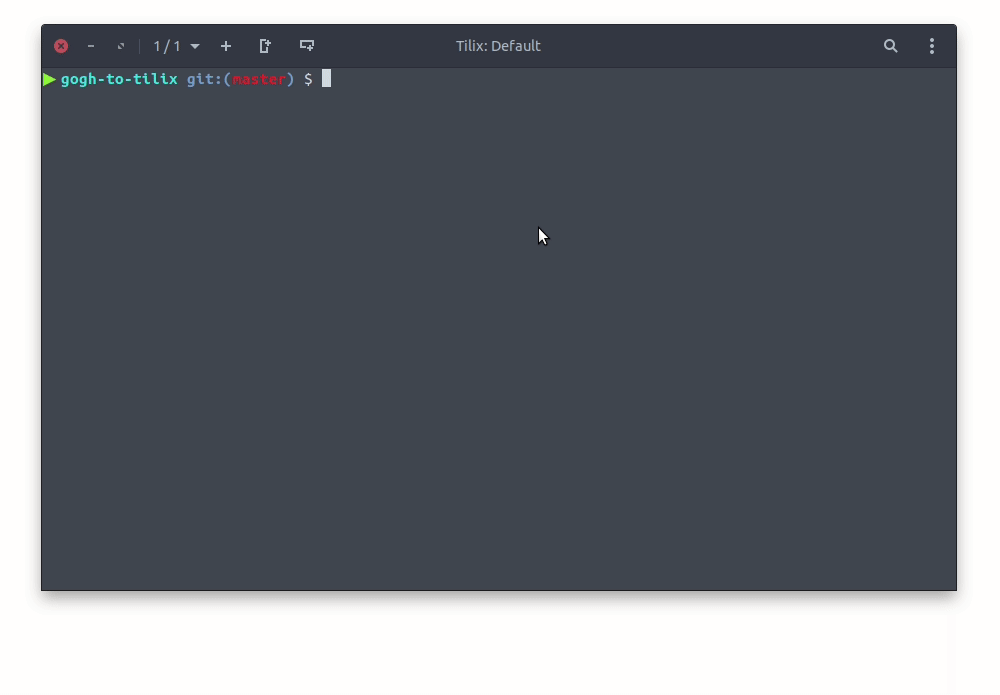

# gogh-to-tilix
Theme generator for https://github.com/gnunn1/tilix

## Install
#### Just to be safe
In order to keep your existing schemes make sure you backup your custom color schemes from the `~/.config/tilix/schemes` directory. In some cases if you have a scheme that has the same name with the new scheme this script overwrites it. So, it is your responsibility to take care of your files. Also, this directory is by default, if you use custom take that one into consideration. 
#### Install
Then to install, first, you need to clone this repository with the sub-modules as follows:
```
git clone --recurse-submodules https://github.com/isacikgoz/gogh-to-tilix.git
```
Then, dive into the local repository and claim the script 
```
cd gogh-to-tilix/
chmod +x install.sh
```
Now we can run the script. But, the script requires your tilix color-scheme folder. it is `~/.config/tilix/schemes` by default. If you use a different directory give that directory to script. Also, make sure that the directory exists.
```
./install.sh ~/.config/tilix/schemes
```
And.. You're done! Enjoy..
## Update
You can regulary check the sub-module [repo](https://github.com/Mayccoll/Gogh) and pull from remote. Then you simply re-run the installation process.
## Uninstall
Again, you should change the execute permissions of `uninstall.sh`
```
cd gogh-to-tilix/
chmod +x uninstall.sh
```
Then, yet again, run the script. But, -again- the script requires the path for the schemes.
```
./uninstall.sh ~/.config/tilix/schemes
```
## Credits
* [Mayccoll](https://github.com/Mayccoll) for the [Gogh](https://github.com/Mayccoll/Gogh) compilation.
* Appreciate to [Gerald Nunn](https://github.com/gnunn1) for the awesome terminal emulator (Tilix)[https://github.com/gnunn1/tilix].